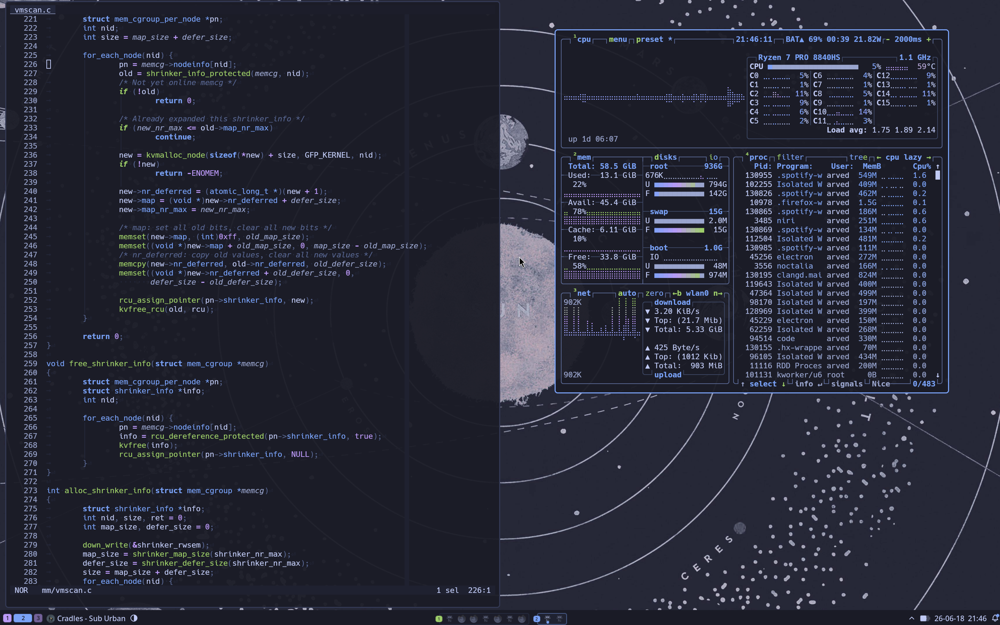
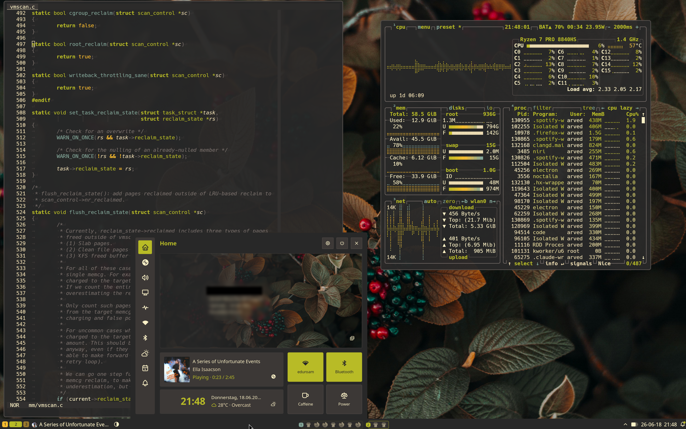

# NixOS Config

A modular NixOS configuration based on [Géza Ahsendorf's setup](https://codeberg.org/DynamicGoose?tab=repositories).

## Screenshots

| Catppuccin | Gruvbox |
|---|---|
|  |  |

## Stack

| Category | Tool |
|---|---|
| Window Manager | [Niri](https://github.com/YaLTeR/niri) (Wayland tiling compositor) |
| Terminal | [Kitty](https://sw.kovidgoyal.net/kitty/) |
| Multiplexer | [Zellij](https://zellij.dev/) |
| Editor | [Helix](https://helix-editor.com/) |
| Shell | Fish |
| Status Bar | [Waybar](https://github.com/Alexays/Waybar) |
| App Launcher | [Walker](https://github.com/abenz1267/walker) |
| Greeter | [Noctalia](https://github.com/noctalia-dev/noctalia-shell) + greetd |
| System Monitor | btop |
| Browser | [Zen Browser](https://zen-browser.app/) |
| Secrets | [sops-nix](https://github.com/Mic92/sops-nix) |
| Framework | NixOS 26.05 + Home Manager |

## Quickstart

### 1. Add to `flake.nix`

```nix
configuration-name = {
  username = "username";
  hashedPassword = "hashedPassword"; # mkpasswd

  # userDescription = "Your Name";
  # hostname = "hostname";
};
```

### 2. Create `hosts/configuration-name/default.nix`

```nix
{ config, pkgs, username, ... }:
{
  imports = [
    ./hardware-configuration.nix
    # ./config.nix  # optional overrides
  ];

  users.users.${username}.packages = with pkgs; [
    # host-specific packages
  ];
}
```

### 3. Copy hardware config

```bash
cp /etc/nixos/hardware-configuration.nix hosts/configuration-name/
sudo nixos-rebuild switch --flake .#configuration-name
```

Requires `nix.settings.experimental-features = [ "nix-command" "flakes" ]`.

### 4. Options

Module options are documented in `options.md`. To use them, create `hosts/configuration-name/config.nix`:

```nix
{ username, ... }:
{
  # modules.desktop.enable = true;
}
```

## Structure

```
.
├── flake.nix          # inputs and host definitions
├── lib/               # flake helpers
├── hosts/             # per-device config + hardware-configuration.nix
├── modules/
│   ├── core/          # base system utilities
│   ├── desktop/       # niri, gtk, fonts, portals
│   ├── programs/      # helix, kitty, zellij, btop, ...
│   └── services/      # audio, waybar, greetd, printing, ...
├── pkgs/              # themes and wallpapers
└── secrets.yaml       # sops-encrypted secrets
```

## Keybindings

### Niri (`Super + ...`)

| Key | Action |
|---|---|
| `P` | Open browser |
| `E` | Open terminal |
| `H/J/K/L` | Navigate windows/workspaces |
| `Ctrl + H/J/K/L` | Move windows between workspaces |
| `R` | Resize window |
| `[` / `]` | Stack windows |

Full bindings in `modules/desktop/niri/niri.nix`.

### Zellij (`Alt + ...`, inside terminal)

Zellij starts in **locked mode** to avoid conflicts with Helix.

| Key | Action |
|---|---|
| `F` | Floating shell |
| `T` | New tab |
| `N` | Split window |
| `Ctrl + G` | Exit locked mode |
